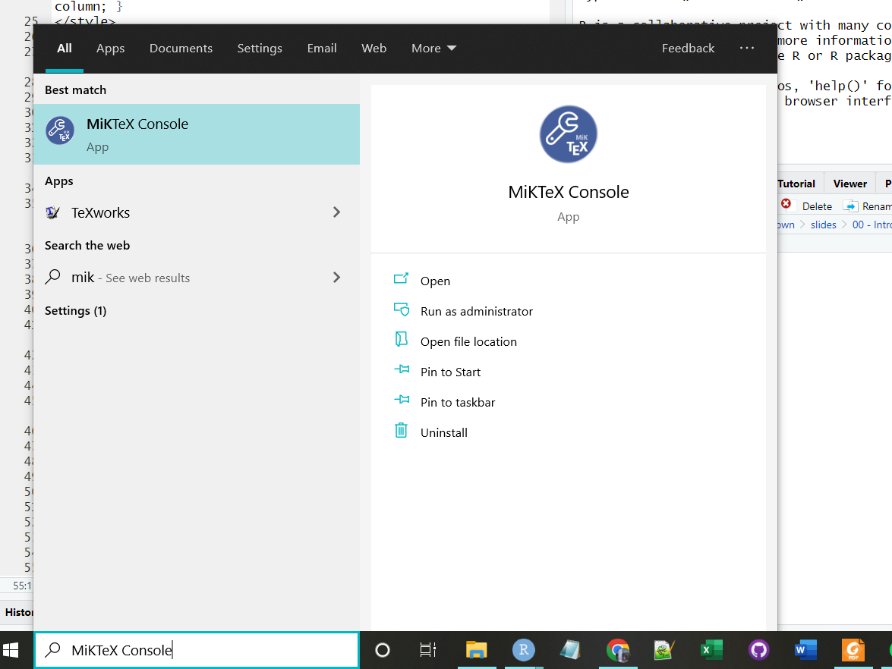
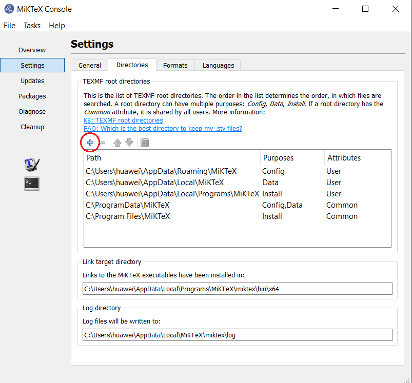
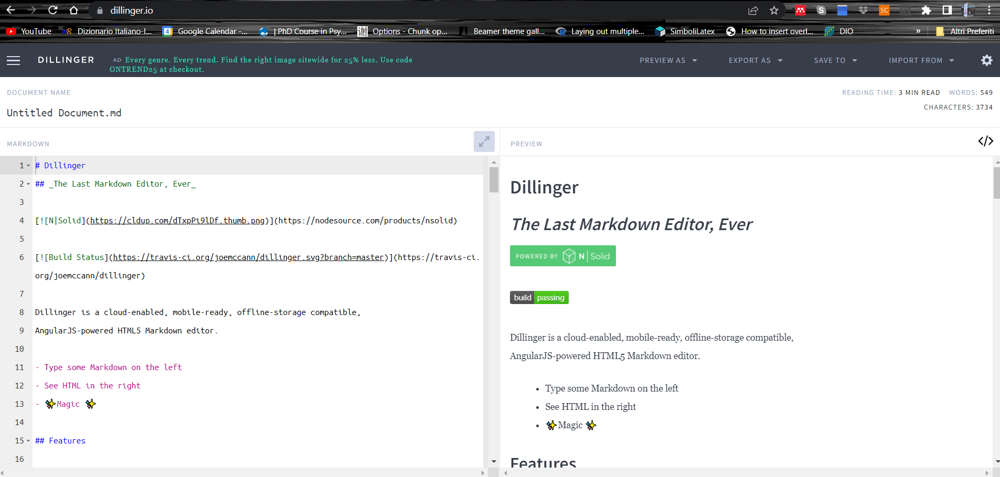
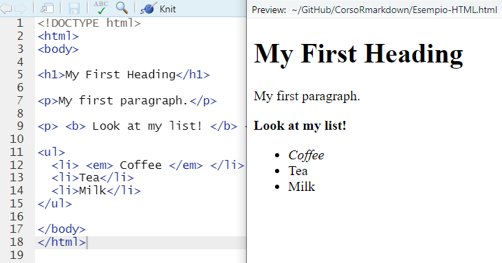
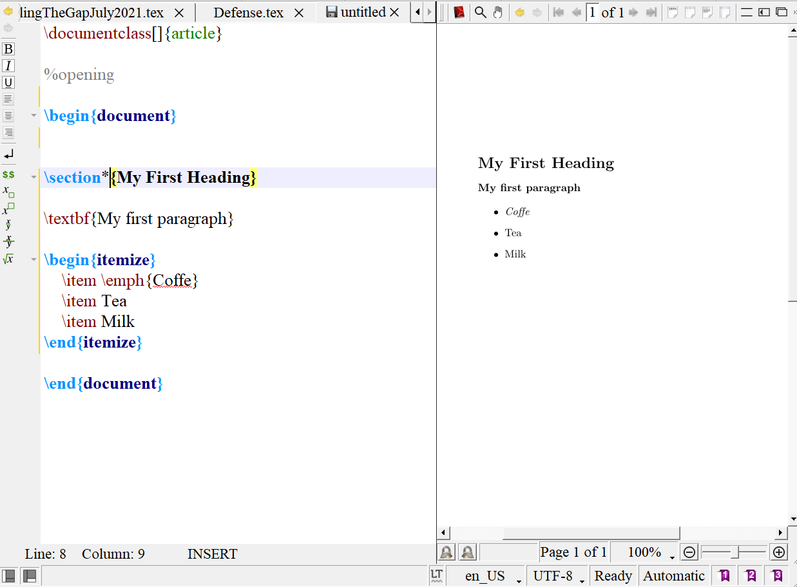
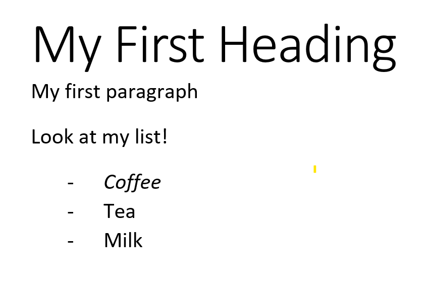
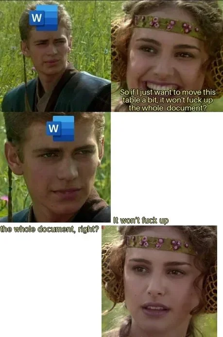

```{r setup, include=FALSE}
knitr::opts_chunk$set(echo = FALSE, 
                      fig.align = "center", 
                      message = FALSE, 
                      warning = FALSE)
library("emoji")
```

<style>
.forceBreak { -webkit-column-break-after: always; break-after: column; }
</style>

# `RMarkdown` <font size = "5">e i disagi del'installazione</font>

## Come è andata l'installazione? 

```{r eval = F, echo = T}

if (installazione.ok == TRUE) {
  
  cat("Nice job!")
}  
else {
  
  cat("Don't worry!")
  
}

```


Se siete riusciti a installare `RMarkdown` senza disagi... meglio per voi!

Se invece non ci siete riusciti o ci siete riusciti ricorrendo a stratagemmi tipo `tinytext` <font size ="4">(che comunque va benissimo)</font>...Don't worry. 

Cerchiamo di essere tutti nella stessa condizione

## Step 1

<br>

<br>

Localizzate la cartella di installazione di `R`. Nel mio computer è così: 

> `C:\Program Files\R\R-4.2.3`

All'interno della cartella di installazione di `R`, cercate il percorso: 

> `share\textmf`
    
Copia & incollate il percorso nel blocco note (o simile)

## Step 2.1

Cercate `MikTex` dalla barra delle applicazioni <font size = "5">(e apritelo)</font>: 


```{r fig.align='center', out.width="70%"}

```


## Step 2.2 

Nel pannello "Directories" del pannello "Settings" cliccate sul "+": 

```{r fig.align='center', out.width="80%"}

```


## Step 2.3

<br>

<br>

Nel prompt che compare Copia & incollate la directory che avete selezionato prima (`C:\Program Files\R\R-4.2.3\share\texmf`)

Chiudete RStudio 

Riaprite tutto e fate correre di nuovo il `File-Check.Rmd`


# `RMarkdown`

## Di cosa stiamo parlando? {.build}

<div>

`markdown` è un markup languange, ossia un linguaggio di programmazione dove la formattazione è gestita da pezzi di codice ("tags"). 

L'estensione dei `markdown` è un file `.md`

</div>

<div>
Sono disponibili diversi software per redigere documenti in `.md`:
</div>


```{r fig.align='center', out.width="60%", fig.cap="https://dillinger.io/"}

```


## Markup languages {.build .columns-2}

HTML è un classico esempio di markup language: 

```{r out.width="90%"}

```

<p class="forceBreak"></p>

Anche LaTeX è un markup language <font size="2"> the best</font>

```{r out.width="90%"}

```

## WYSIWYG system

Word <font size ="2">(o Google docs o Libre Office o Pages)</font> è un sistema **W**hat **Y**ou **S**ee **I**s **W**hat **Y**ou **G**et $\rightarrow$ il prodotto finale è uguale a quello che si vede sullo schermo

Il testo viene direttamente modificato attraverso dei comandi built-in, con combinazioni di tasti o attraverso il menu di formattazione.

```{r fig.align="center", out.width="50%"}

```

## Ma allora perché...? {.build}


```{r fig.align='center',out.width="35%"}

```

## Non solo

- `RMarkdown` permette di inserire **direttamente nel file di testo** i risultati delle analisi svolte, inclusi i grafici!


- Il codice usato per le analisi è dentro il file di report o la presentazione stessa: non si rischia di perdere qualche pezzo per strada

- `r emoji("musical notes")` All you need is `knit` `r emoji("musical note")` 

## Un esempio

Questo grafico:

```{r, out.width="60%"}
library(ggplot2)
ggplot(iris, 
       aes(x=Sepal.Length, y = Petal.Length)) + geom_point() + 
  geom_smooth(method="lm") + theme_light()

```

Ma vi viene chiesto di cambiare colore alla retta di regressione <font size="2"> (Le cose importanti) </font>!

## Cosa dovreste fare {.build .columns-2}

<div>
In Word: 

- Ripredere il codice che avete usato
- Fare le modifiche al codice
- Creare il grafico
- Salvare il grafico
- Metterlo dentro al file Word, al posto di quello vecchio
</div>


<p class="forceBreak"></p>

<div>

In `RMarkwown` all you need is `knit` `r emoji("musical note")` :

- Prendere il codice usato per generare il grafico:

```{r eval = FALSE, echo = TRUE}
library(ggplot2)
ggplot(iris, 
       aes(x=Sepal.Length, y = Petal.Length)) + 
  geom_point() + theme_light()
  geom_smooth(method="lm")

```

- Aggiungere il colore che volete (`geom_smooth(method="lm", color="red")`)
- Cliccare `knit`
</div>


## Cosa può fare `RMarkdown`?{.build}

- Produrre testi in HTML e PDF <font size="3">(volendo anche in `.docx` ma è **molto** sconsigliato)</font>

- Produrre presentazioni in HTML e PDF <font size="3">(volendo anche in `.pptx` ma è **molto** sconsigliato)</font>

- Produrre file PDF usando il motore di LaTeX

- Le slides di questo corso

<div align="center">
**MA SOPRATTUTTO**
</div>

Permette la riproducibilità dei dati e delle analisi svolte sugli stessi tenendo in unico file report, dati, codici e risultati


## Cosa faremo in questo corso {.small}

- Baby steps: Comandi basici di `RMarkdown` 

- Chunk di codice: Dalle immagini ai grafici passando per i codici

- Creazione di un documento PDF con bibliografia 

- Creazione di una presentazione in HTML 

- LaTeX e `RMarkdown` insieme

- Piccoli assaggi di `xaringan` e `quarto`


## Piccola esercitazione finale

Due file: 

- Un PDF con almeno: 
   - Un elenco, parole con diversa formattazione, una tabella, un grafico, un chunk di codice, un'equazione e risultati di `R` nel testo

- Una presentazione in HTML con almeno 3 slide e: 
   - Colonne, tabella, testo progressivo, un chunk di codice, una tabella con i risultati del modello e un plot

In [questa cartella](https://drive.google.com/drive/folders/19F1fhDwih04MeyKP_E4xLsPc0VAw-3co?usp=sharing) vi ho preparato degli esempi di file (tra cui quello per la tesi)

[Qui](https://forms.gle/5PkBkhLMLnkPQSXg6) trovate il questionario da compilare a fine corso per dire se il corso vi è piaciuto

## Cosa non faremo in questo corso

<br>

<br>


[](https://pagedown.rbind.io/): Rende  più facile il rendering in PDF

[](https://bookdown.org/): Come sopra


# Let's get started `r emoji("partying face")`

## Ordine ordine ordine ordine (e ancora ordine)

<div align="center">
`Rstudio` Project
</div>

Consente di creare una directory e di organizzarla in subdirectory all'interno di cui vengono messi tutti i file (immagini, dati, bibliografia) necessari per la creazione della tesi/report/presentazione che si sta facendo

Mantiene tutto in ordine e facilmente controllabile

File $\rightarrow$ New project: 

<div align="center">

</div>

## 

Dire cosa si vuole fare

<div align="center">

</div>

Dove lo si vuole fare e come lo si vuole chiamare

<div align="center">

</div>

# Con cosa lavoriamo?

## I dataset di `R` {.build}


<div>
Useremo dei datasets interni ad `R` per fare qualche analisi e qualche grafico (tranquilli, vi darò io i codici `r emoji("beaming face with smiling eyes")`)

A [questa pagina](https://docs.google.com/document/d/1xBr-zNRTvUrKABrU7CQDM_8rZVg2gmij_aaP-0laljM/edit) trovate un doc con la lista dei vari datasets con una piccola descrizione delle variabili

Ad ognuno viene assegnato un dataset e dovrà lavorare su quello per tutto il corso
</div>

<div align="center">
`r emoji("hourglass")`

Assegnazione dataset in corso
</div>

(Se avete dei dataset vostri su cui volete lavorare, be my guest, a patto che siate abbastanza autonomi sul codice)

## Your turn!


- Create un progetto sul vostro desktop (è il progetto su cui lavorerete per questo corso, scegliete un bel nome `r emoji("winking face")`)
- Aprite un file di `R`  
- "Giocate" con il dataset che vi è stato assegnato (`head()`, `str()`)

<div align="center">
ADVANCED
</div>

- Salvate il dataset in un oggetto chiamato `data` (tip: `<-`)


