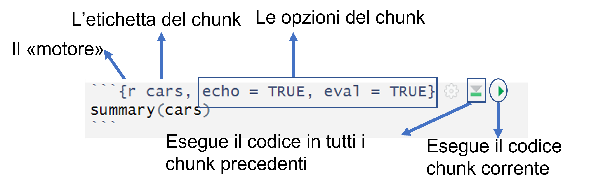
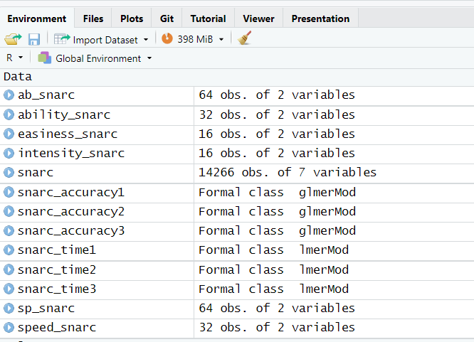
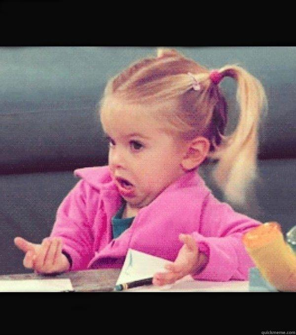

<style>
.forceBreak { -webkit-column-break-after: always; break-after: column; }

.myClass {font-size: 16px;}

</style>

```{css, echo=FALSE}
pre {
  max-height: 500px;
  overflow-y: auto;
}

pre[class] {
  max-height: 400px;
}

.scroll-100 {
  max-height: 300px;
  overflow-y: auto;
  background-color: inherit;
}
```

```{r setup, include=FALSE}
knitr::opts_chunk$set(echo = FALSE, 
                      fig.align = "center", 
                      out.width = "60%", 
                      message =FALSE, 
                      warning = FALSE, tidy = TRUE,  
                      prompt = TRUE)
library(emoji)
library(knitr)
library(ggplot2)
library(tidyverse)
library(kableExtra)
# cut output credit https://bookdown.org/yihui/rmarkdown-cookbook/hook-truncate.html
# save the built-in output hook
hook_output <- knitr::knit_hooks$get("output")

# set a new output hook to truncate text output
knitr::knit_hooks$set(output = function(x, options) {
  if (!is.null(n <- options$out.lines)) {
    x <- xfun::split_lines(x)
    if (length(x) > n) {
      # truncate the output
      x <- c(head(x, n), "....\n")
    }
    x <- paste(x, collapse = "\n")
  }
  hook_output(x, options)
})

```

## Cosa sono

Sono quello che rende `RMarkdown` così "speciale". 

Permettono di integrare i documenti con i risultati delle analisi e con i codici usati per ottenerle <font size="3">(tutti i miei materiali supplementari alle riviste sono prodotti con `RMarkdown`)</font>

Per crearli, basta usare la combinazione di tasti `Ctrl + Alt + i` (`Cmd + Alt + i` se si ha il Mac):


```{r}
include_graphics("img/chunk-vuoto.png")
```

(si può anche usare l'icona </img>)


## Il file di default


```{r fig-chunk, out.width="80%", fig.cap="Il chunk"}

```

Tutte le opzioni che si vogliono dare al chunk (e.g., come mostrare i risultati, come mostrare le figure, se mostrare o meno le figure ecc.) vanno separate dalla virgola e scritte a mano 

## Oppure 

Oppure si selezionano le opzioni base desiderate dal menu che appare cliccando sulla rotellina del chunk stesso: 

```{r}
include_graphics("img/rotella.png")
```

<font size = "4">
A [questa pagina](https://yihui.org/knitr/options/) è disponibile una lista esaustiva degli argomenti dei chunk di codice

Stessa cosa ma più schematica disponibile  [qui](https://www.rstudio.com/wp-content/uploads/2015/03/rmarkdown-reference.pdf?_ga=2.224317531.1994910762.1649682827-1292953261.1617471531)</font>

## Setup chunk {.build}

<div>
Qui vanno specificate tutte le opzioni di default che vogliamo applicare al nostro documento, i pacchetti che pensiamo di usare per le nostre analisi, i dati, gli environment (per fare prima) eccetera. 
</div>

<div>
Un esempio di setup chunk è:

```{r out.width="70%"}
include_graphics("img/setup.png")
```
</div>

A meno che non venga specificato altrimenti, ogni chunk del documento seguirà le opzioni di default specificate nel setup chunk

## Warning 

L'environment di `R` e l'environment di `RMarkdown` sono due cose diverse

Il fatto che voi vediate degli oggetti nel vostro environment come nell'esempio qui sotto non implica che siano importati automaticamente dentro RMarkdown


<div style="float: left; width: 50%; text-align: left;">
    
```{r fig.align="center", fig.cap="R environment", out.width="95%"}

```

    
 </div> 

<div style="float: right; width: 50%; text-align: right;">
```{r fig.align="center", fig.cap="RMarkdown"}

```

</div>

## Warning I


<br>


<br>


Dovete ogni volta scrivere il codice per generare l'environment in modo che corra *senza errori*

Un'altra opzione è di importare l'environment salvato con il comando `load()` 

## Your turn!

- Importate il vostro dataset nel setup chunk e assegnatelo a un oggetto:

```{r eval = FALSE, echo = TRUE}
data(nome_dataset)
dati = nome_dataset
```

- Create un nuovo chunk dove esplorate il dataset (`head(dati)`)

<div align="center">
ADVANCED
</div>

- Fate sparire il codice di `R` dall'output
- Salvate l'environment di `R` e richiamatelo nel setup chunk (hint: `load()`)


# Codice e risultati


## Codice eseguito e risultati mostrati

````
```{r, echo=TRUE, eval=TRUE}`r ''`
ggplot(rock, 
       aes(y=peri,x=shape, color =shape, size = peri)) + geom_point() + 
  theme_bw() + theme(legend.position = "none") 

```
````

```{r, echo = TRUE, eval = TRUE}
ggplot(rock, 
       aes(y=peri,x=shape, color =shape, size = peri)) + geom_point() + 
  theme_bw() + theme(legend.position = "none") 

```

## Risultati senza codice

````
```{r, echo=FALSE, eval=TRUE}`r ''`
ggplot(rock, 
       aes(y=peri,x=shape, color =shape, size = peri)) + geom_point() + 
  theme_bw() + theme(legend.position = "none") 

```
````

```{r}
ggplot(rock, 
       aes(y=peri,x=shape, color =shape, size = peri)) + geom_point() + 
  theme_bw() + theme(legend.position = "none") 
```


## Codice senza risultati (non eseguito) 

````
```{r, echo=TRUE, eval=FALSE}`r ''`
ggplot(rock, 
       aes(y=peri,x=shape, color =shape, size = peri)) + geom_point() + 
  theme_bw() + theme(legend.position = "none") 
```
````

```{r, echo = TRUE, eval =FALSE}
ggplot(rock, 
       aes(y=peri,x=shape, color =shape, size = peri)) + geom_point() + 
  theme_bw() + theme(legend.position = "none") 
```

## Codice eseguito, nessun risultato, nessun codice

<br>

<br>

````
```{r, include=FALSE}`r ''`
library(ggplot2)
```
````
Non appare niente, non sono prodotti risultati visibili

L'opzione `include=FALSE` solitamente viene usata nel setup chunk e in tutti quei chunk di cui non interessa vedere un risultato ma che contengono un codice importante

## Messaggi di errore, warning, messaggi

- Molti pacchetti di `R` mostrano dei messaggi quando vengono caricati o quando viene usata qualche funzione. Per toglierli: `message=FALSE`

- Per togliere i warning (ad esempio quando usiamo `lme4` e fittiamo modelli molto complessi): `warning=FALSE`

- Per togliere i messaggi di errore (e.g., viene chiamato un oggetto che non esiste): `error=FALSE`


````
```{r, message=FALSE, error=FALSE, warning=FALSE}`r ''`
ggplot(mtcars, aes(x=cyl,y=mpg, group=cyl)) + geom_boxplot()
```
````

<font size ="4">`r emoji("warning")` i messaggi di errore/warning sono spariti, gli errori che li causano esistono ancora!!!</font>

## `eval=FALSE` vs. `results='hide'` {.columns-2}

<div align-items=center;>
`eval=FALSE`
</div>

- Il codice **non** viene eseguito
- Se ci sono degli errori, non ve ne accorgete
- Particolarmente utile quando si vuole spiegare un codice molto complesso (ma dovete essere sicuri che funzioni)

<p class="forceBreak"></p>

<div align-items=center;>
`results='hide'`
</div>

- Il codice **viene** eseguito
- Se ci sono degli errori il codice non va
- Particolarmente utile quando si vuole spiegare un codice più semplice 

## Risultati un po' più carini

Di default, i risultati vengono mostrati così:

```{r}
rock[1:3, ]
```

I cancelletti si possono togliere con l'argomento `comment`, settato uguale a quello che più vi piace:

````
```{r, comment=" "}`r ''`
rock
```
````


```{r, comment=" "}
rock
```

## Risultati un po' più carini PT. II

Il codice si può troncare in modo che non venga quell'orrore che avete visto: 

Setup chunk: 

```{r echo = TRUE, eval=FALSE}
hook_output <- knitr::knit_hooks$get("output")

knitr::knit_hooks$set(output = function(x, options) {
  if (!is.null(n <- options$out.lines)) {
    x <- xfun::split_lines(x)
    if (length(x) > n) {
      # truncate the output
      x <- c(head(x, n), "....\n")
    }
    x <- paste(x, collapse = "\n")
  }
  hook_output(x, options)
})
```


## 

Nel chunk che volete tagliare: 

````
```{r, comment=" ", out.lines=4}`r ''`
rock
```
````


```{r comment = " ", out.lines=4}
rock
```

Ricordate che una delle righe che volete mostrate è "mangiata" dai nomi delle colonne


## Your turn!

- Create un nuovo chunk per il summary dei dati `summary(dati)` **senza**
 codice e con "NA" al posto degli hashtag nell'output
 - Nuovo chunk dove eseguite il codice del vostro dataset che trovate [qui](https://ottaviae.github.io/CorsoRmarkdown/Datasets-Codici.html) (non fate la regressione e il grafico) **ma non mostrate né il codice né i risultati**
- Nuovo chunk dove eseguite il codice del grafico (`plot(data$y ~ data$x)`) **senza** codice
- Nuovo chunk dove mostrate il codice del grafico (`plot(data$y ~ data$x)`) **senza** risultati
- Tagliate l'output del vostro dataset in modo che vengano mostrate le prime 10 osservazioni

# Le tabelle

## La sintassi classica (Don't panic)


```markdown
| Colonna 1 | Colonna 2 | Colonna 3 |
|-----------|-----------|-----------|
| 1         | 2         | 3         |
| 4         | 5         | 6         |
```

Che mi dà: 


| Colonna 1 | Colonna 2 | Colonna 3 |
|-----------|-----------|-----------|
| 1         | 2         | 3         |
| 4         | 5         | 6         |

Ci sono dei [compilatori automatici](https://www.tablesgenerator.com/markdown_tables#) che ci risparmiano la fatica, ma non è comunque il massimo

Stessa sintassi in `html` e `PDF`

## Integrare con `R`!

Ci sono diversi pacchetti che ci permettono di creare tabelle direttamente dai dataset senza fare fatica: 

- [xtable](https://cran.r-project.org/web/packages/xtable/vignettes/xtableGallery.pdf)
- [stargazer](https://cran.r-project.org/web/packages/stargazer/vignettes/stargazer.pdf) `r (emoji("heart"))`
- [sjPlot](https://cran.r-project.org/web/packages/sjPlot/index.html) (per le tabelle di correlazione non c'è niente di meglio)
- [kable e kableExtra](https://cran.r-project.org/web/packages/kableExtra/vignettes/awesome_table_in_html.html)

In pratica, noi facciamo le nostre analisi e il pacchetto scelto le sistema in tabelle pronte all'uso!

## Tabelle senza fatica {.build}

<div>

Semplicemente l'output di `R`:

```{r, echo = TRUE, out.lines= 6}
(summary_cars = rock %>% 
  group_by(perm) %>% 
  summarise(mean = mean(peri), 
            sd = sd(peri),
            min = min(peri), 
            max = max(peri)) )
```
</div>

<div>

`r emoji("smile")` rapido, efficace, colpo d'occhio 
</div>
<div>
`r emoji("sad")` Nella tesi non sta molto bene
</div>

## `stargazer` `r emoji("heart")`

`r emoji("smile")` Fa in automatico i summary dei dataset

`r emoji("smile")` Sistema in tabella i risultati dei modelli

`r emoji("smile")` Stessa sintassi per html e PDF 

`r emoji("smile")` Perfetto per model comparison

`r emoji("sad")` Non va bene per riportare le tabelle di summary preparate da noi. 

`r emoji("sad")` è ottimmizzato per LaTex (ossia per produrre i PDF). 

<div align="center">
FONDAMENTALE:  
</div>

````
```{r, results='asis'}`r ''`

```
````

## `stargazer` summary 

````
```{r, results='asis'}`r ''`
library(stargazer)
stargazer(rock, type="latex", summary = TRUE, 
           title= "Tabella di summary", digits = 2, header=FALSE)
```
````


```{r class.output="scroll-100"}
library(stargazer)
stargazer(rock, type="latex", summary = TRUE, 
           title= "Tabella di summary", digits = 2, header=FALSE)
```

## `stargazer` model 

```{r, results='asis', echo = TRUE, tidy=TRUE, class.source='myClass', class.output="scroll-100"}
m1 = lm(peri ~ perm, data = rock)
stargazer(m1, type="html", summary = TRUE, 
           title= "Risultati del modello", digits = 2, header=FALSE)
```

## `stargazer` model comparison

```{r, echo = TRUE, results='asis', echo = TRUE, tidy=TRUE, class.source='myClass', class.output="scroll-100"}
m0 = lm(peri ~ 1, data = rock)
m1 = lm(peri ~ perm, data = rock)
stargazer(m0, m1, 
          type = "html",
          title="Model comparison", digits=2, intercept.top = TRUE, intercept.bottom = FALSE, header = FALSE)
```

## Your turn!

- Tabella di summary del vostro dataset con 3 decimali
- Tabella di summary del vostro modello di regressione 
- Caption per ognuna delle tabelle

<div align="center">
ADVANCED
</div>


- Tabella di model comparison con modello nullo `m0` (`m0 = lm(y ~ 1, data = dati)`)

## Codice (e risultati) nel testo

Avete visto che nelle mie slide appaiono degli elementi scritti con la formattazione del codice di  `R`

Ottenerli è molto semplice:  `` `R` `` mi restituisce `R`

Ma molto di più: `` `r "\u0060r mean(rock$peri)\u0060"` `` mi restituisce `r mean(rock$peri)` (Provateci!)

Se in un chunk precedente avessimo assegnato `x = mean(mtcars$mpg)`, avrremmo potuto semplicemente scrivere `` `r "\u0060r x\u0060"` ``

## Codice, equazioni e codice nelle equazioni

$$\bar{X} = \frac{\displaystyle\sum_{i=1}^{n}x_i}{n}$$

Per `mpg`: 

```{r echo = FALSE, eval=TRUE}
x = round(sum(mtcars$mpg), 2)
```


$$\bar{X} = \frac{\displaystyle\sum_{i=1}^{n}x_i}{n} = \frac{`r x`}{`r nrow(mtcars)`} = `r round(round(sum(mtcars$mpg),2)/nrow(mtcars), 2)`$$

`` `r "$\\frac{\u0060r round(sum(mtcars$mpg),2)\u0060}{\u0060r nrow(mtcars)\u0060} = \u0060r round(round(sum(mtcars$mpg),2)/nrow(mtcars), 2)\u0060$"` ``

## Your turn!

- Provate a scrivere la formula per standardizzare la variabile $y$ sup: 

$$z =   \frac{x_i - \bar{X}}{sd}$$


- Standardizzate il primo valore della $y$ del vostro dataset e riportate il risultato nell'equazione

```{r}
data = mtcars
data$y = data$mpg
```


$$z_i = \frac{x_i - \bar{x} }{sd} = \frac{`r data$y[1] - mean(data$y)`}{`r sd(data$y)`} = `r (data$y[1] - mean(data$y))/sd(data$y)` $$


`` `r "$$z_i = \\frac{x_i - \\bar{x}}{sd} = \\frac{\u0060r data$y[1] - mean(data$y)\u0060}{\u0060r sd(data$y)\u0060} = \u0060r (data$y[1] - mean(data$y))/sd(data$y) \u0060$$"` ``

# Saltellando tra HTML e PDF 

## Output specifici per formati specifici

Esiste la possibilità di far apparire degli oggetti diversi a seconda dell'output richiesto (`HTML` o `PDF`)

- `knitr::is_latex_output()`: Testa che il file venga compilato per produrre un PDF

- `knitr::is_html_output()`: Testa che il file venga compilato per produrre un PDF

Queste funzioni si possono usare sia negli argomenti dei chunk di codice sia nel codice riportato all'interno del testo


## Compilato in HTML ma non in PDF 


````
```{r plot-interactive, echo=FALSE, eval=knitr::is_html_output()}`r ''`
grafico = ggplot(rock, 
       aes(y=peri,x=shape, color =shape, size = peri)) + geom_point() + 
  theme_bw() + theme(legend.position = "none") 
plotly::ggplotly(grafico)

```
````


```{r plot-interactive}
grafico = ggplot(rock, 
       aes(y=peri,x=shape, color =shape, size = peri)) + geom_point() + 
  theme_bw() + theme(legend.position = "none") 
plotly::ggplotly(grafico)
```

## Compilato in PDF ma non in HTML 


````
```{r plot-static, echo=FALSE, eval=knitr::is_latex_output()}`r ''`
grafico = ggplot(rock, 
       aes(y=peri,x=shape, color =shape, size = peri)) + geom_point() + 
  theme_bw() + theme(legend.position = "none") 
grafico

```
````


```{r plot-static}
grafico = ggplot(rock, 
       aes(y=peri,x=shape, color =shape, size = peri)) + geom_point() + 
  theme_bw() + theme(legend.position = "none") 
grafico
```


## Possono stare nello stesso file

Pandoc gestisce automaticamente l'output che viene mostrato a seconda del motore di compilazione che viene utilizzato

````
```{r, echo=FALSE, eval=knitr::is_html_output()}`r ''`
grafico = ggplot(rock, 
       aes(y=peri,x=shape, color =shape, size = peri)) + geom_point() + 
  theme_bw() + theme(legend.position = "none") 
plotly::ggplotly(grafico)
```
````


````
```{r, echo=FALSE, eval=knitr::is_latex_output()}`r ''`
grafico = ggplot(rock, 
       aes(y=peri,x=shape, color =shape, size = peri)) + geom_point() + 
  theme_bw() + theme(legend.position = "none") 
grafico
```
````


## In-line code 

Alcuni tag sono specifici per HMTL o PDF, ad esempio per il cambio colore del testo 

Se si utilizza il codice `\color{red} Voglio una frase rossa \normalcolor` in un file compilato in PDF si ottiene questo risultato: 

<span style="color:red">Voglio una frase rossa</span>

Se lo si utilizza in un file compilato in HTML il risultato potrebbe non essere dei migliori: 

    \color{red} Voglio una frase rossa \normalcolor

## In-line code condizionato {.build}


Vanno usate le funzioni `knitr::is_latex_output()` e `knitr::is_html_output()`, con qualche aggiunta: 


- Va espressamente testato il motore della compilazione (funzione `ifelse()`) all'interno di un in-line code di `R` (`` `r ` ``)

- Va definito l'output `asis`

`` `r "\u0060r knitr::asis_output(ifelse(knitr::is_html_output(), '<span style='color:red'>parola</span>', '\\color{red} Voglio una frase rossa \\normalcolor'))\u0060"` ``

<!-- ## Tabelle interattive  -->

<!-- ```{r table-interactive, echo = FALSE, eval = is_html_output()} -->
<!-- mtcars[1:8, 1:8] %>% -->
<!--   kbl() %>% -->
<!--   kable_paper(full_width = F, "hover") %>% -->
<!--   column_spec(2, color = spec_color(mtcars$mpg[1:8]), -->
<!--               link = "https://haozhu233.github.io/kableExtra/") %>% -->
<!--   column_spec(6, color = "white", -->
<!--               background = spec_color(mtcars$drat[1:8], end = 0.7)) -->
<!-- ``` -->


## Your turn!

- Provate a inserire un grafico interattivo e uno statico, condizionando la loro comparsa al motore di compilazione 

- Cambiate il colore del testo...sia per HTML sia per PDF!

