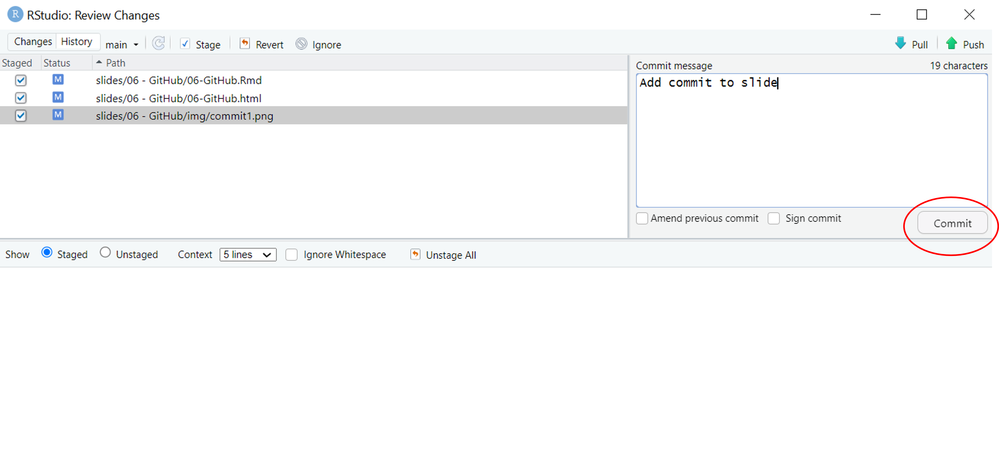

<style>
.forceBreak { -webkit-column-break-after: always; break-after: column; }

.myClass {font-size: 16px;}
</style>

```{css, echo=FALSE}
pre {
  max-height: 700px;
  overflow-y: auto;
}

pre[class] {
  max-height: 500px;
}

.scroll-100 {
  max-height: 500px;
  overflow-y: auto;
  background-color: inherit;
}
/* specify logo size at title page */
.gdbar img {
  width: 160px !important;
  height: 122px !important;
  margin: 8px 8px;
  background: none;
}

.gdbar {
  height: 140px !important;
  background: none;
}


/* GENERAL SLIDES */


h2 {
    color: #9B0A14;
}

h3 {
    color: #9B0A14;
}

.remark-slide-content {
    font-size: 20px;
    line-height: 1.6;
}


/* bullet list */

ul li { 
    padding: 8px 0px;
    list-style-type: disc;
}

a, a > code {
  color: rgb(249, 38, 114);
  text-decoration: none;
}

.footnote {
  position: absolute;
  bottom: 3em;
  padding-right: 4em;
  font-size: 90%;
}
/* chpater pages */

slides > slide.dark {
  background-color: #9B0A14 !important;
}

/* SECTION SLIDE */

.section {
  background-color: #9B0A14;
  color: white;;
  text-shadow: 0 0 0px #333;
}

.section h1, .inverse h2, .inverse h3 {
  color: #F0F3F4;
  font-size: 50px;
}

.section .remark-slide-number {
  display: none;
}


/* code size*/

code.r {
  font-size: 22pt;
}

code.css {
  font-size: 18pt;
}

/* TITLE SLIDE */

.title-slide {
    background:linear-gradient(180deg, #9B0A14 25%,white 25%)
}

.title {
  font-size: 60px;
  color: white;
}

.subtitle {
  font-size: 30px;
}

.author {
  color: #3B3B3B;
  font-size: 20px;
}

.location {
  color: #3B3B3B;
  font-size: 20px;
}

.title-slide .remark-slide-number {
  display: none;
}

/* TEXT COLORS */

.imp {
  color: #9B0A14;
  font-weight: bold;
}

.blue {
  color: #2980B9;
  font-weight: bold;
}

.green {
  color: #17A589;
  font-weight: bold;
}

.yellow {
  color: #F5B041;
  font-weight: bold;
}

.hljs-github .hljs {
    display: block;
    overflow-x: auto;
    padding: .5em;
    color: #333;
    background: #f8f8f8;
}
```


```{r setup, include=FALSE}
knitr::opts_chunk$set(echo = F,
                      eval = TRUE,
                      fig.align = "center")
# cut output credit https://bookdown.org/yihui/rmarkdown-cookbook/hook-truncate.html
# save the built-in output hook
hook_output <- knitr::knit_hooks$get("output")

# set a new output hook to truncate text output
knitr::knit_hooks$set(output = function(x, options) {
  if (!is.null(n <- options$out.lines)) {
    x <- xfun::split_lines(x)
    if (length(x) > n) {
      # truncate the output
      x <- c(head(x, n), "....\n")
    }
    x <- paste(x, collapse = "\n")
  }
  hook_output(x, options)
})
library("emoji")
```


# Installare Git 

## Creare un account Git {.build}

[](https://github.com/) [https://github.com/](https://github.com/)

<br>

<br>

```{r}

```

## Utilizzare una mail personale {.build}

```{r}

```


```{r}

```


## Creare Username e password

Lo username deve essere il più breve e significativo possibile... e soprattutto deve essere qualcosa di cui non vergognerete tra 5 anni 

<br>


```{r}

```


Risolvere i CAPTCHA e finalizzare la procedura

## Installare GitHub Desktop 

[https://desktop.github.com/](https://desktop.github.com/)

<br>


```{r}

```


## Installare Git {.build}

GitHub desktop vi permette un collegamento "indiretto" tra quello che fate in RStudio e GitHub

<br>

Per avere un collegamento diretto va installato [Git](https://gitforwindows.org/ ) seguendo semplicemente le istruzioni di installazione

<br>


```{r}

```


# Gestire le repository

## Creare una nuova repository 

Sempre attraverso la creazione dei progetti 

```{r out.width="70%"}

```

## "Clonare" una repository esistente I {.build}

<div>
Si fa tutto attraverso GitHub desktop (il sofwtware con il gattino viola)

File $\rightarrow$ **Add Local Repository** $\rightarrow$ scegliere il percorso della cartella che si vuole pubblicare su GitHub 

</div>


```{r out.width="80%"}

```


## "Clonare" una repository esistente II {.build}

Selezionare **create a repository** 

```{r}

```


## La repository deve essere pubblica

```{r out.width="90%"}

```

# GitHub pages

## `README.md` {.build}

<div>
Questo è il file che gestisce tutte le vostre pagine 

Funziona come un indice in cui potete scrivere una presentazione della vostra repository e potete linkare tutte le pagine (HTML o PDF) in modo che sia dei link condivisibili 
</div>


```{r, out.height="90%"}
knitr::include_graphics(path = "img/readme.png")
```
```{r, out.height="80%"}
knitr::include_graphics(path = "img/site.png")
```

## I link 

I link nel `README.md` sono a tutti gli effetti dei link... nel senso che si scrivono con la sintassi che si usa per linkare pagine online

L'unica differenza consiste nel fatto che si linka il percorso del file che vogliamo 

Ad esempio, voglio che la mia pagina linki a un file HTML che si chiama `my_file.html` ed è contenuto nella cartella `files`: 

        [La mia presentazione](files/my_file.html)
        
        
## Creare le pagine 

```{r out.width="70%"}
knitr::include_graphics("img/pages-git.png")
```


        
## `commit` + `push`

Bisgona far "parlare" quello che fate in locale con GitHub online

```{r out.width="70%"}

```

## 

```{r out.width="70%"}

```


Non dimenticate di cliccare anche su Push!

## Tutt'appost?

<br>

```{r out.width="80%"}
knitr::include_graphics("img/check-commit.png")
```

## Trovare il link 

```{r out.width="80%"}
knitr::include_graphics("img/pages.png")
```


## Your turn! 

- Create un account GitHub e attrezzatevi per installare il software sul vostro PC 

- Create un nuovo progetto inizializzato come Git Repository (selezionando la spunta sul `gitignore`)

- Aggiungete almeno un file in HTML (consiglio quarto perché vi permette più interattività in modo più semplice) e create la vostra pagina online


