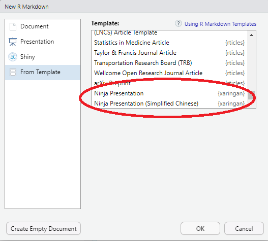

```{css, echo=F, eval = T}

.inverse {
  background-color: #272822;
  color: #d6d6d6;
  text-shadow: 0 0 20px #333;
}
.scrollable {
  height: 500px;
  overflow-y: auto;
}
.scrollable-auto {
  height: 80%;
  overflow-y: auto;
}
.remark-slide-number {
  display: none;
}
```

```{r setup, include=FALSE}
options(htmltools.dir.version = FALSE)
knitr::opts_chunk$set(fig.align = "center", 
                      out.width = "60%", 
                      message =FALSE, 
                      warning = FALSE, tidy = TRUE,  
                      prompt = TRUE)
library(tidyr)

```


---


# Cos'è xaringan


<br>
<br>

- Un altro modo per fare le slide usando sempre `R`

- Utilizza RMarkdown ma tramite un motore che non è pandoc

- Il risultato: slide molto belle con meno fatica 

- Offre infinite possibilità ma vedremo solo alcune feature  


---


# Installazione

Nella console di RStudio basta scrivere: 


```{r eval=FALSE, tidy=FALSE}
install.packages("xaringan")
```

premere invio e attendere il termine dell'installazione-

--

Per aprire un nuovo file: 

```{r echo = FALSE}

```


---

# Il file di default 


- Il file di default che viene creato all'apertura contiene un sacco di informazioni utili su xaringan 

- Fornisce un template per nuove presentazioni 

- Capendo come e dove modificare quel template vi trovate con una presentazione più che dignitosa! 

---

class: middle, center

# Presentazioni in xaringan

---


# Yaml


<br>
<br>

```yaml
---
  xaringan::moon_reader:
    lib_dir: libs
    css: [default, default-fonts]
    nature:
      highlightStyle: github
      highlightLines: true
      highlightLanguage: r
      highlightSpans: true
      countIncrementalSlides: false
---

```

---

## Yaml: dettagli

.scrollable[


```yaml
---
  xaringan::moon_reader:
    lib_dir: libs
*    css: [default, default-fonts]
    nature:
      highlightStyle: github
      highlightLines: true
      highlightLanguage: r
            highlightSpans: true
      countIncrementalSlides: false
---

```

Si possono definire i css da usare per la presentazione. xaringan fornisce una serie di css tra cui poter scegliere: 


```{r}
names(xaringan:::list_css())
```


]


---


## Yaml: dettagli

.scrollable[


```yaml
---
  xaringan::moon_reader:
    lib_dir: libs
    css: [default, default-fonts]
    nature:
*      highlightStyle: github
      highlightLines: true
      highlightLanguage: r
      highlightSpans: true
      countIncrementalSlides: false
---

```

Le diverse modalità con cui si possono mostrare i chunk di codice: 

```{r eval=FALSE}
arta, ascetic, dark, default, far, github, googlecode, idea, ir-black, 
magula, monokai, rainbow, solarized-dark, solarized-light, sunburst, 
tomorrow, tomorrow-night-blue, tomorrow-night-bright, tomorrow-night, 
tomorrow-night-eighties, vs, zenburn
```


]


---

## Yaml: dettagli

.scrollable[


```yaml
---
  xaringan::moon_reader:
    lib_dir: libs
    css: [default, default-fonts]
    nature:
      highlightStyle: github
*      highlightLines: true
      highlightLanguage: r
      highlightSpans: true
      countIncrementalSlides: false
---

```

Permette di evidenziare le righe di codice segnate: 

- `*` all'inizio delle riga di codice

- Codice "rinchiuso" tra `{{ }}`

- Codice seguito da #<<


]


---

## Yaml: dettagli

.scrollable[


```yaml
---
  xaringan::moon_reader:
    lib_dir: libs
    css: [default, default-fonts]
    nature:
      highlightStyle: github
      highlightLines: true
*      highlightLanguage: r
      highlightSpans: true
      countIncrementalSlides: false
---

```

Ogni linguaggio ha un suo modo specifico di essere riportato e si può scegliere


]


---

## Yaml: dettagli

.scrollable[
```yaml
---
  xaringan::moon_reader:
    lib_dir: libs
    css: [default, default-fonts]
    nature:
      highlightStyle: github
      highlightLines: true
      highlightLanguage: r
*      highlightSpans: true 
      countIncrementalSlides: false 
---

```

Se viene messo ` highlightSpans: true` permette di evidenziare solo delle parti specifiche di codice invece che la riga intera. 

Basta mettere il codice che si vuole evidenziare dentro i backtick `` `codice da evidenziare` ``:

  `iris` `` `%>%` ``
  
`summary()`


````
iris `%>%` 
  summary()
```

]


---

## Yaml: dettagli
.scrollable[
```yaml
---
  xaringan::moon_reader:
    lib_dir: libs
    css: [default, default-fonts]
    nature:
      highlightStyle: github
      highlightLines: true
      highlightLanguage: r
      highlightSpans: true
*      countIncrementalSlides: false 
---

```

Settando `countIncrementalSlides: true` le slide incrementali vengono conteggiate nel totale 


]

---

class: inverse, middle, center

# Formattazioni generali 

---

# Creare una nuova slide

```yaml
* ---
# Titolo 
## Sottotitolo 
  
Testo 

* --- 

```


I tre tick iniziali `---` sono fondamentali per creare la nuova slide, non basta più mettere solo il cancelletto 


---

## Le pause 


```yaml
---
# Titolo 
## Sottotitolo (non è obbligatorio)
  
Testo che appare subito

* --

Testo che appare dopo la pausa 

* --

Testo che appare al terzo click del mouse

--- 

```

---

#  Due colonne, stessa grandezza 


.pull-left[
**Testo nella parte sinistra**

<br>

<br>

<span style="color:red">Parola colorata (HTML)</span>]


.pull-right[
.center[*Testo nella parte destra*]

<br>

<br>

<font size="2">Testo mini</font>
]


---

#  Due colonne, stessa ampiezza: Codice

```{markdown, eval = F}
.pull-left[
**Testo nella parte sinistra**

<br>

<br>

<span style="color:red">Parola colorata (HTML)</span>]


.pull-right[
.center[*Testo nella parte destra*]

<br>

<br>

<font size="2">Testo mini</font>
]
```


---

# Colonne di ampiezza differente

.left-column[
- Un 

- Elenco

- Puntato 
]

.right-column[
```{r}
iris %>% 
  summary()
```

]

---

#  Due colonne, ampiezza differente: Codice

```{markdown, eval = F}
.left-column[
- Un 

- Elenco

- Puntato 
]

.right-column[

]
```
---

# Immagini 

.pull-left[
``


<br>

<br>


`
]

.pull-right[
````
```{r, fig.cap = "Caption", fig.align="center", out.width="50%"}`r ''`
knitr::include_graphics(path = "percorso-alla-figura")
```
````

```{r, echo = F,  fig.align="center"}
knitr::include_graphics(path = "img/rose.jpeg")
```

<br>

<br>


]


---
# Matematica 

Esattemente come in `Rmarkdown`: 

.pull-left[
`$y = \alpha + \beta X + \varepsilon$` 


<br>

<br>

`$ $\frac{p}{1-p}$ $`

]

.pull-right[
$y = \alpha + \beta X + \varepsilon$


<br>

<br>
$$\frac{p}{1-p}$$
]

---

# Codice R

```{r comment=''}

fit = lm(dist ~ 1 + speed, data = cars)
coef(summary(fit))


```

---

# Plot

```{r fig.height=4, dev='svg'}
par(mar = c(4, 4, 1, .1))
plot(cars, pch = 19, col = 'darkgray', las = 1)
abline(fit, lwd = 2)
```

---

# Tabelle
 
 Le tabelle devono essere in formato HTML (non vale la sintessi specifica di RMarkdown). 
 
Va usato direttamente il pacchetto [kable](https://cran.r-project.org/web/packages/kableExtra/vignettes/awesome_table_in_html.html) per ottenere delle tabelle velocemente: 
 
```{r}
knitr::kable(head(iris), format = 'html')
```

---

# Tabelle... pro 

.scrollable[
Va installato il pacchetto `DT` (`install.packages("DT")`). 


````
```{r}`r ''`
library(DT)
DT::datatable(
  head(iris, 10),
  fillContainer = FALSE, options = list(pageLength = 8)
)
```
````


```{r echo = F}
library(DT)
DT::datatable(
  head(iris, 10),
  fillContainer = FALSE, options = list(pageLength = 5)
)
```

]


---

# Codice scrollabile

.scrollable[
Può essere utile avere il codice che non si interrompe alla fine della pagina ma che scorre. 

Per farlo, va aggiunto un po' di codice: 

````
```{css, echo=F, eval = T}`r ''`

.inverse {
  background-color: #272822;
  color: #d6d6d6;
  text-shadow: 0 0 20px #333;
}
.scrollable {
  height: 500px;
  overflow-y: auto;
}
.scrollable-auto {
  height: 80%;
  overflow-y: auto;
}
.remark-slide-number {
  display: none;
}
```
````

In questo modo viene creata una classe (`.scrollable`) che ci permette di rendere il codice scrollabile

]


---

# Un esempio

.scrollable[
```markdown
.scrollable[

irt.icc = function(model) {
  item_par = model$item
  est_theta = seq(-4,4, length.out=1000)
  item_prob = list()
  if (any(grep("guess", colnames(item_par))) == F) {
    for (i in 1:nrow(item_par)) {
      item_prob[[i]] = data.frame(theta = est_theta)
      item_prob[[i]]$it_p = IRT(item_prob[[i]]$theta, 
                          b = item_par[i, "xsi.item"], 
                          a = item_par[i, "B.Cat1.Dim1"])
      item_prob[[i]]$item = item_par[i, "item"]
}
  } else {
     for (i in 1:nrow(item_par)) {
      item_prob[[i]] = data.frame(theta = est_theta)
      item_prob[[i]]$it_p = IRT(item_prob[[i]]$theta, 
                          b = item_par[i, "AXsi_.Cat1"], 
                          a = item_par[i, "B.Cat1.Dim1"], 
                          c = item_par[i, "guess"])
      item_prob[[i]]$item = item_par[i, "item"]
}
  }
  p = do.call("rbind", item_prob)
  gp = ggplot(p, 
       aes(x = theta, y = it_p, group = item, col =
             item)) + geom_line(lwd = 1)
  object = list(prob.data = p, 
              icc.graph = gp)
return(object)
}
]


```
]


---


class: inverse,  middle

# Your turn! 

Provate a creare una presentazione con xaringan che abbia: 

- Una slide con una tabella (possibilmente versione pro!)

- Una slide con due colonne di uguale ampiezza (a sx il codice per fittare il modello a dx il summary dei risultati)


- Una slide con due colonne di diversa ampiezza (a sx il codice per fittare il modello a dx il grafico dei risultati)

- Una slide con codice scrollabile
